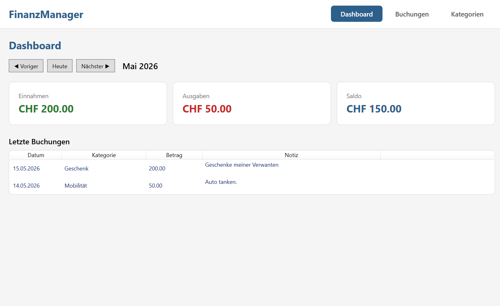
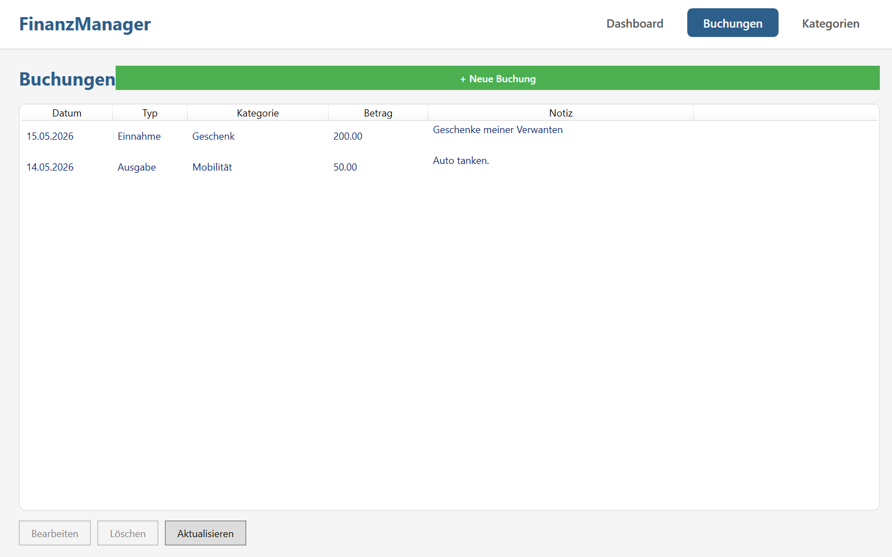
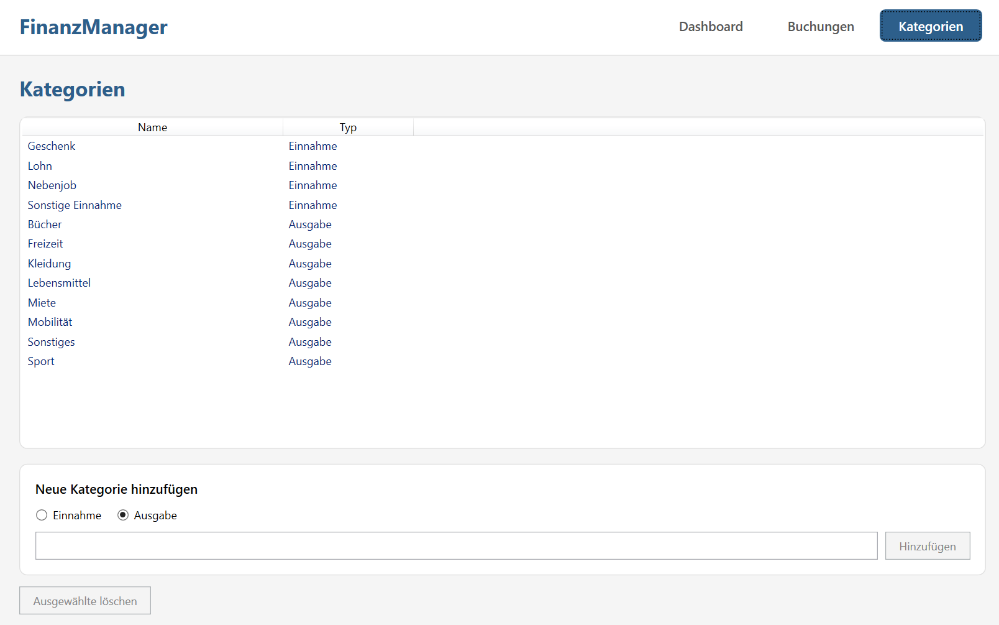

# FinanzManager

Persönliches Haushaltsbuch als WPF-Desktop-App in C# / .NET 8.

Erfasst Einnahmen und Ausgaben, gruppiert sie nach Kategorien und wertet sie monatlich aus. Lokale SQLite-Datenbank, keine Cloud, keine Anmeldung.

---

## Screenshots

Die folgenden Bilder zeigen die Hauptansichten der App:

| Dashboard | Buchungen | Kategorien |
|-----------|-----------|------------|
|  |  |  |

---

## Features

- **Buchungen erfassen** — Einnahmen und Ausgaben mit Datum, Betrag (CHF), Kategorie und optionaler Notiz
- **Buchungen bearbeiten und löschen** — über einen modalen Dialog
- **Filter** — Buchungsliste nach Monat und Kategorie einschränken
- **Monatsübersicht (Dashboard)** — Einnahmen, Ausgaben, Saldo und die letzten Buchungen für einen wählbaren Monat
- **Kategorien verwalten** — Anlegen, Auflisten und Löschen (mit Schutz, falls Buchungen daran hängen)
- **Persistente Speicherung** — lokale SQLite-Datenbank unter `%APPDATA%\FinanzManager\finanzmanager.db`
- **Vor-konfigurierte Kategorien** — beim ersten Start werden 12 typische Kategorien (Lohn, Miete, Lebensmittel, ...) angelegt

---

## Technologie-Stack

| Bereich     | Technologie                                |
|-------------|--------------------------------------------|
| Sprache     | C# 12                                      |
| Framework   | .NET 8 (LTS)                               |
| UI          | WPF mit XAML                               |
| Architektur | MVVM (Model-View-ViewModel)                |
| Datenbank   | SQLite via Entity Framework Core 8         |
| DI          | Microsoft.Extensions.Hosting (Generic Host)|

---

## Architektur

Die Anwendung folgt einer klaren Schichten-Trennung nach dem MVVM-Pattern:

```
View (XAML)         <-- bindet an -->   ViewModel (C#)
                                              |
                                              v
                                        Repository (Interface)
                                              |
                                              v
                                        DbContext (EF Core)
                                              |
                                              v
                                        SQLite-Datei
```

Wichtige Design-Entscheidungen:

- **MVVM ohne externes Framework** — eigene `ViewModelBase`, `RelayCommand` und `AsyncRelayCommand` für volle Kontrolle und besseres Verständnis.
- **Repository-Pattern mit Interfaces** — `IBuchungRepository` und `IKategorieRepository` entkoppeln die ViewModels vom konkreten Datenzugriff (Dependency Inversion).
- **DbContextFactory statt scoped DbContext** — empfohlener Ansatz für Desktop-Apps, weil keine HTTP-Requests die Scope-Grenzen definieren.
- **DialogService** — ViewModels öffnen Dialoge über ein Interface (`IDialogService`), ohne direkt vom `Window`-Typ abzuhängen.
- **VM-First-Navigation** — das `MainViewModel` hält das aktuelle Sub-ViewModel; WPF rendert es automatisch über passende `DataTemplate`-Einträge.
- **Dependency Injection** — alle Services, Repositories und ViewModels werden im DI-Container in `App.xaml.cs` registriert.
- **`decimal` statt `double` für Beträge** — keine Fliesskomma-Ungenauigkeiten in Geld-Berechnungen.

---

## Projektstruktur

```
FinanzManager/
├── FinanzManager.sln              Solution-Datei
├── README.md                      Dieses Dokument
├── .gitignore                     Git-Ausschlussregeln (bin/, obj/, *.db, ...)
└── FinanzManager/                 Hauptprojekt
    ├── FinanzManager.csproj       Projektdatei + NuGet-Pakete
    ├── App.xaml(.cs)              Einstiegspunkt + DI-Container
    ├── MainWindow.xaml(.cs)       Hauptfenster (Navigation + ContentControl)
    │
    ├── Models/                    Datenmodelle
    │   ├── Buchung.cs             Eine Einnahme oder Ausgabe
    │   ├── Kategorie.cs           Gruppierung für Buchungen
    │   └── BuchungsTyp.cs         Enum: Einnahme / Ausgabe
    │
    ├── Data/                      Datenzugriffsschicht
    │   ├── FinanzDbContext.cs     EF Core DbContext + Seeding
    │   ├── Statistiken/
    │   │   └── MonatsStatistik.cs Record für Monats-Aggregat
    │   └── Repositories/
    │       ├── IBuchungRepository.cs   / BuchungRepository.cs
    │       └── IKategorieRepository.cs / KategorieRepository.cs
    │
    ├── MVVM/                      MVVM-Infrastruktur
    │   ├── ViewModelBase.cs       INotifyPropertyChanged-Helfer
    │   ├── RelayCommand.cs        Synchroner ICommand
    │   └── AsyncRelayCommand.cs   Async ICommand mit Re-Entry-Schutz
    │
    ├── Services/                  Anwendungsdienste
    │   ├── IDialogService.cs
    │   └── DialogService.cs       Öffnet modale Dialoge, zeigt MessageBoxen
    │
    ├── ViewModels/                ViewModels (Bindings-Quellen)
    │   ├── MainViewModel.cs           Navigation + aktive Sektion
    │   ├── DashboardViewModel.cs      Monatsübersicht
    │   ├── BuchungenViewModel.cs      Liste + Filter
    │   ├── KategorienViewModel.cs     Kategorien-Verwaltung
    │   └── BuchungBearbeitenViewModel.cs   Formular im Dialog
    │
    └── Views/                     Weitere XAML-Fenster
        ├── BuchungBearbeitenWindow.xaml
        └── BuchungBearbeitenWindow.xaml.cs
```

---

## Setup

**Voraussetzungen**

- Windows 10 oder höher
- Visual Studio 2022 (Community Edition reicht) oder JetBrains Rider
- .NET 8 SDK (wird mit Visual Studio mitgeliefert)

**Projekt starten**

1. Repository klonen:
   ```
   git clone https://github.com/<dein-benutzername>/FinanzManager.git
   ```
2. `FinanzManager.sln` in Visual Studio öffnen.
3. Beim ersten Öffnen lädt Visual Studio automatisch alle NuGet-Pakete.
4. Mit `F5` starten (Debug-Modus).

Die SQLite-Datenbank wird beim ersten Start automatisch unter `%APPDATA%\FinanzManager\finanzmanager.db` angelegt und mit Standardkategorien befüllt.

---

## NuGet-Pakete

| Paket                                      | Version  | Zweck                                  |
|--------------------------------------------|----------|----------------------------------------|
| Microsoft.EntityFrameworkCore.Sqlite       | 8.0.10   | SQLite-Provider für EF Core            |
| Microsoft.EntityFrameworkCore.Design       | 8.0.10   | Design-Time-Tools (Migrations etc.)    |
| Microsoft.Extensions.Hosting               | 8.0.1    | Generic Host für DI / Hosted Services  |

---

## Lizenz

Privates Lernprojekt — keine Lizenz, freie Verwendung als Inspiration für eigene Projekte ist willkommen.
